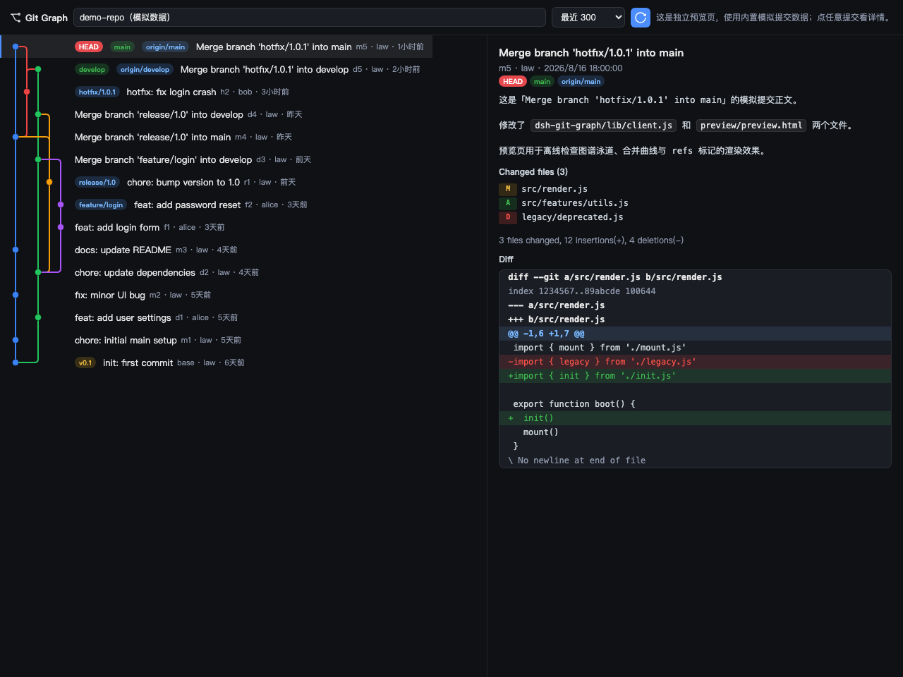

# dsh-git-graph

给 DeepSeek Harness（DSH）Web GUI 加的 **Git 提交图谱可视化插件**，效果对标 VS Code 的 [Git Graph](https://marketplace.visualstudio.com/items?itemName=mhutchie.git-graph) 扩展：把当前会话仓库的分支、合并、标签关系画成一张彩色的泳道图，点任意提交即可查看完整信息、改动文件与 diff。



## 这是什么

DSH 的 Web 界面原本没有图形化的提交历史视图。`dsh-git-graph` 补上了这块：它直接读取会话工作目录所在的 git 仓库，用 `git log --all --topo-order` 拉取提交 DAG，在浏览器里渲染成 VS Code Git Graph 风格的泳道图，让你不离开界面就能看清整个仓库的演进脉络。

## 功能

- **泳道图**：每个分支一条彩色泳道；分叉拐角向右上、合入拐角向右下，统一圆角直角样式。
- **分支配色**：按分支名稳定分配高区分度颜色（main 蓝 / develop 绿 / release 琥珀 / hotfix 红 / feature 紫…），合并线沿用被合并分支的颜色。
- **Refs 标记**：`HEAD`（红）、本地分支（绿）、远程分支（蓝）、`tag`（黄）以彩色 pill 标注在对应提交旁。
- **提交列表**：短 hash、作者、相对时间与主题，逐行与圆点对齐（结构上保证不漂移）。
- **提交详情**：点击任意提交，右侧面板展示完整信息、改动文件列表（M/A/D/R）、stat 统计，以及 GitHub 风格的 **diff 语法高亮**（新增绿 / 删除红 / 块头蓝）；正文里的 `` `反引号代码` `` 也会高亮。
- **仓库路径**：只读显示当前会话工作目录。
- **数量上限**：下拉选择「全部 / 最近 100 / 300 / 500 / 1000 / 2000」，默认 300，选「全部」不限制条数。

## 入口

- 若安装了 [`dsh-better-sidebar`](https://github.com/omdsh-dev/DSH-better-sidebar)，会自动注册一个带官方分支图标的 **Git Graph** 侧边栏标签页。
- 无论是否安装 sidebar，侧边栏底部都会有一个分支图标按钮（hover 有提示），点击打开全屏浮动面板。

## 架构

插件分两部分，通过 HTTP 路由桥接：

| 部分 | 文件 | 职责 |
|---|---|---|
| Host（Node 端） | `lib/git.js` | `spawn git` 构建提交 DAG、refs、提交详情与 diff |
| Host（Node 端） | `lib/index.js` | 注册 `/gitgraph/api` 路由（`graph` / `commit`），含 CSRF 防护 |
| 共享渲染逻辑 | `lib/graph.js` | **唯一真源**：泳道布局、分支配色、SVG/HTML 生成、diff 高亮（纯函数，不依赖 React） |
| Client（浏览器端） | `lib/client.js` | React 面板外壳（生成物，由构建脚本内联 `lib/graph.js`） |

数据流：浏览器 `fetch('/gitgraph/api/graph')` → host 用 `git` 命令读取仓库 → 返回 JSON → 客户端做泳道布局并逐行渲染成 SVG。

### 共享逻辑与构建

`lib/graph.js` 是图渲染逻辑的唯一真源，`lib/client.js`（插件）和 `preview/preview.html`（离线预览）都从它生成，不再各自手写一份。修改图渲染逻辑后，只改 `lib/graph.js`，然后重新构建：

```bash
npm run build   # 等价于 node scripts/build.mjs
```

脚本会把 `lib/graph.js` 内联进 `src/client.template.js` 和 `src/preview.template.html`，生成 `lib/client.js` 与 `preview/preview.html`。

## 预览

无需安装，直接用浏览器打开 `preview/preview.html` 即可离线查看图谱渲染效果（泳道 / 圆角拐角 / 分支配色 / refs 标记 / 提交详情 / diff 高亮），使用内置 git flow 模拟数据。工具栏同样有只读路径框、提交数量下拉和刷新按钮。

## 安装

```bash
dsh plugin --profile web add file:/Users/law/Documents/code/law-dsh-plugin/dsh-git-graph
```

然后**重启 dsh web**（`Ctrl+C` 后重新运行 `dsh web`），刷新 `http://127.0.0.1:3080` 即可。

## 卸载

```bash
dsh plugin --profile web remove dsh-git-graph
```

重启 dsh web 即可。

## 说明

- 仓库路径取会话头部的 `cwd`（即 DSH 会话的工作目录）；若为空回退到 dsh web 进程的 `process.cwd()`。
- 提交数量默认 300；选「全部」时 `git log` 不拼 `-n`，拉取全部提交（超大仓库可能较慢）。
- 合并提交的 diff 使用 `-m --first-parent`，保证总能展示内容。
- 所有 `git` 调用均为只读操作，不修改仓库状态。

## License

MIT
